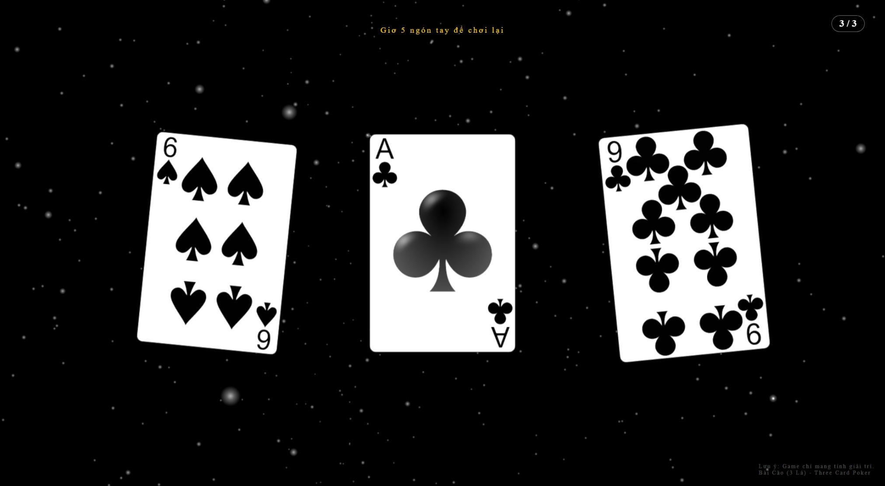

# 🖐️ Hand Gesture Poker

Một trải nghiệm chơi **Bài Cào 3D** độc đáo, được điều khiển hoàn toàn bằng cử chỉ tay ngay trên trình duyệt web. Không cần chuột hay bàn phím—chỉ cần dùng đôi tay của bạn để tráo bài, rút bài và chơi lại!

## ✨ Tính Năng Nổi Bật

- **👋 Theo Dõi Bàn Tay (Hand Tracking)**: Sử dụng công nghệ **MediaPipe** để nhận diện cử chỉ tay chính xác theo thời gian thực.
- **🃏 Đồ Họa 3D Sống Động**: Xây dựng trên nền tảng **Three.js** với các quân bài được bo tròn mềm mại, hiệu ứng hạt lấp lánh và ánh sáng động.
- **🔄 Điều Khiển "Không Chạm"**:
  - **Tráo Bài (Pinch 👌)**: Chụm ngón cái và ngón trỏ để điều khiển tốc độ xoay/tráo bài.
  - **Rút Bài**: Hệ thống tự động rút bài dựa trên nhịp điệu tráo của bạn.
  - **Chơi Lại (Open Hand ✋)**: Xòe 5 ngón tay thẳng ra để reset game ngay lập tức.
- **🚀 Tối Ưu Hóa**: Khởi động tức thì, giao diện sạch sẽ, không quảng cáo, hiệu ứng mượt mà.

## 🎮 Cách Chơi

1.  **Cấp Quyền Camera**: Vào trang web và cho phép trình duyệt truy cập webcam (để nhận diện tay).
2.  **Tráo Bài**:
    - Đưa tay lên trước camera.
    - **Chụm** ngón trỏ và ngón cái lại (**👌 Pinch**).
    - Điều chỉnh khoảng cách giữa 2 ngón để thay đổi tốc độ xoay của các lá bài.
3.  **Rút Bài**:
    - Khi bạn thả tay hoặc giữ nhịp ổn định, game sẽ tự động rút ra 1 lá bài.
    - Lặp lại cho đến khi đủ **3 lá bài**.
4.  **Lật Bài**:
    - Khi đủ 3 lá, các lá bài sẽ bay vào giữa màn hình và lật lên để hiện kết quả.
    - Các lá bài thừa xung quanh sẽ tự động bay đi chỗ khác để bạn nhìn rõ kết quả.
5.  **Chơi Lại (Reset)**:
    - Để chơi ván mới, chỉ cần **Giơ Cao Bàn Tay và Xòe 5 Ngón** (✋).
    - Game sẽ tự động tải lại (reload) ngay lập tức.

## 📝 Luật Chơi

Game mô phỏng trò chơi Bài Cào 3 lá dân gian Việt Nam:

- Tính điểm dựa trên **hàng đơn vị** của tổng 3 lá bài.
- **A (Át)** = 1 điểm.
- **2 - 9** = Điểm tương ứng số.
- **10, J, Q, K** = 10 điểm (hoặc tính là 0).
- _Ví dụ_: 4 + 7 + 9 = 20 -> **0 nút (Bù)**.
- _Ví dụ_: J + Q + 5 = 25 -> **5 nút**.
- _Đặc biệt_: **Ba Tây (3 Cào)** (3 lá hình J, Q, K bất kỳ) hoặc **Sáp** (3 lá giống nhau) là lớn nhất.

---

## 📄 License & Bản Quyền

Dự án được phân phối dưới giấy phép [MIT License](LICENSE).

Bản quyền thuộc về [https://github.com/htrnguyen](https://github.com/htrnguyen).
